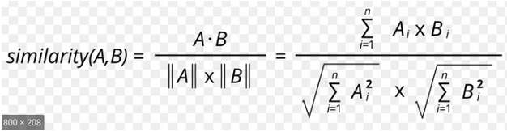
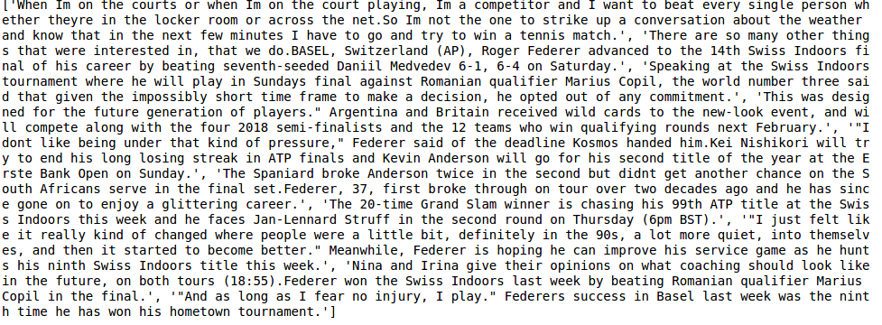
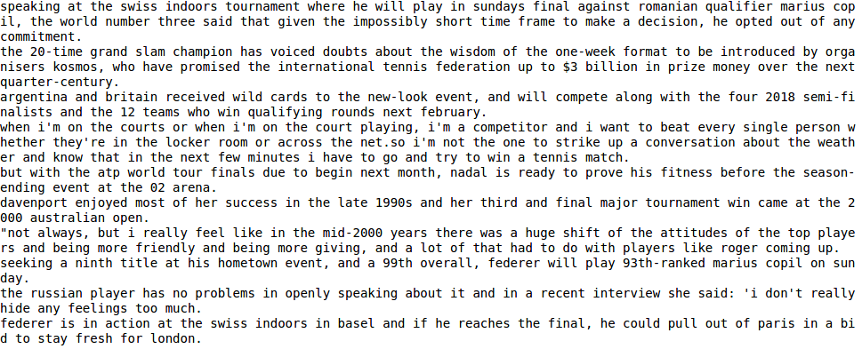

# Text Summarization 

 <b>Shristi Kumari(BITS Pilani)</b> 

This project contains comparison of different Extractive Summarization approaches for Automatic Text Summarization. It also contains a novel approach of generating summary using **Minimum Connected Dominating Set : A Graph Theoretic Approach.**

# Introduction
With the recent increase in the amount of content available online, fast and effective automatic summarization has become more important. The need for getting maximum information by spending minimum time has led to more efforts being directed to the field of summarization. There are 2 major approaches to text summarization:

**Extractive Summarization :** Using this approach the summary is obtained by extracting statements and words directly from the given document. The important statements and phrases are identified from the text and they form part of the final summary.

**Abstractive Summarization :** Using this approach the summary presents in a concise way what the text is trying to convey. The meaning is understood and presented in a compact manner. 

Major challenges faced in extractive summarization arises because of scoring of sentences and words to decide which are more important and should be included in the final summary. There are different approaches used for assigning the score some of which are tf-idf scoring, sentence length, rare words count, verb and adjective count etc. 

# Data
The Data used in this project is available in the Data folder. It contains tennis news articles from different newspapers and the task is to generate a coherent and concise summary from it. Within the document the data in column **"article text"** is used for summarization. Sentences are tokenized and cleaned by removing punctuation marks and are converted to lowercase.

# Libraries and Technologies Used

**nltk, Google Word2Vec, Gensim, Networkx, numpy, matplotlib, pandas, sklearn.**

# Approach 
Generating Text Summary using minimum Connected Dominating set can be divied in the following major steps:

**STEP 1 : PreProcessing (removing stop words, non letter characters, turning to lower case letters)**

**STEP 2 : Sentence Graph Generation where edges are formed using cosine similarity between sentences**

**STEP 3 : Finding minimum Connected Dominating Set and outputting the summary**

Each subpart is described in detail below.

## PreProcessing
This was the first stage in the algorithm in which the entire text was converted in lower case letters to maintain uniformity and non alphabet characters were removed. Along with that stop words (a, an etc) were also removed from the text using nltk’s stopwords list. Stop words are words like ‘is’,’and’,’or’ etc. which are not of much importance. **NLTK** library already has predefined stopwords for english language. rem_stop module is created which takes a sentence, removes stop words from it and returns it. Sentences processed are stored in list called cleaned_sentences. This list was then passed to the sentence graph generation phase. 

## Sentence Graph Generation
In this phase the input was the preprocessed text document from part 1 and a graph modeled from the input document is given as output from this stage. The graph consists of vertices which are vector representation of the input sentences. The vector representation of the sentences is obtained using **Google Word2Vec** in which pretrained vector representation of input words are given. In Google word2vec, vector length is 300 features and the features are learnt using Unsupervised Machine Learning Techniques. The pretrained vector representation of the words are available as a model in **Gensim** and are loaded in the variable word_embeddings. Using the vector representation of words the representation of sentences is obtained by taking the average of the vector representation of the words present in the sentence.
Using the vector representation of the sentences which act as vertices of the graph, edge weights (weight of an edge joining 2 vertices of the graph) are generated using cosine similarity between the 2 vector representation of the vertices which is given mathematically as :

Where Ai, Bi are the ith component of vectors A and B respectively.

The edges and the vertices finally form our output graph from part 2. **Networkx** Library is used to generate the graph which is the output from part 2.

## Minimum Connected Dominating Set for Summary Extraction
The graph generated from part 2 is given as input to the minimum Connected Dominating Set algorithm which gives as output the minimum Connected Dominating Set of the input graph and the vertices of this set are actually sentences from the original document and thus, these sentences form the final summary. The different steps in this part are as follows :
1. The third part begins with the graph generated from the above 2 stages and is checked for its connectedness as there is no point of obtaining a connected dominating set from a disconnected graph. 
2. After the initial check the node with the maximum degree which is made a fixed node. Maximum degree node is taken to ensure that the final output is minimum Dominating Set.
3. Neighbor_nodes, a set data structure is generated as the set of neighbouring nodes of starting node. It is sorted (converted to list) according to the degree of the nodes. A priority_queue is maintained which is the backbone of the code.  The sorted neighbourhood nodes of fixed nodes are stored in the priority queue. Inserted_set is the list of total nodes and includes both fixed as well as the neighbouring ones ; it is the set of all the nodes which are to be tested in later iterations.
4. In each iteration a node is popped out (the node popped is the one with the highest degree). The node is removed temporarily (rest_graph is created) and then checked if the rest_graph remains connected or not. If the rest_graph remains connected then the node can be removed. Otherwise the node is fixed (added to fixed_nodes) and its neighbours are also added to the priority queue (for next iteration).
5. The itertion continues till all the nodes in the set are visited after which the subgraph generated is checked for its dominating property and connected property to verify the result. 

Fixed Nodes are finally the Connected Dominating Set and are outputted as the final summary of the original input text.

# Results

The following are the snapshots of summary generated by different approahes:

## Summary Generated by minimum Connected Dominating Set Approach
Summary is generated by modelling input text as a graph and finding Connected Dominating Set from the graph as described above. 

## Summary Generated by Gensim 
Data is read in the initial phase and given as input to Gensim's summarize method which produces the desired result.

## Summary generated by tf-idf algorithm
Summary is generated from the top ranked sentences where sentences are ranked using tf-idf scores.

## Summary generated by Text Rank algorithm
Summary is generated by modelling as graph and applying text rank algorithm on it.

## Analysis

As it can be observed summary Generated by the CDS Algorithm and the ones generated by other approaches are quite similar in terms of keywords. The summary generated by CDS is longer as it focuses more on connectivity between sentences. Gensim Approach uses ranking approach to generate summary which calculates importance of sentences and doesn’t take into account the semantics of document. CDS approach on the other hand takes semantics of document into account and therefore generates a more **cohesive** document. The presence of connectedness makes the summary **coherent** and **logical**; without which the summary appears to have jumps between consecutive sentences and becomes more difficult to understand. The idea of using domination helps in removing the need of scoring the sentences and tackles one of the biggest challenges in Extractive Text Summarization.

